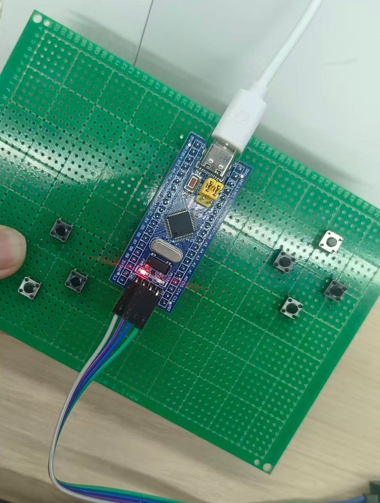
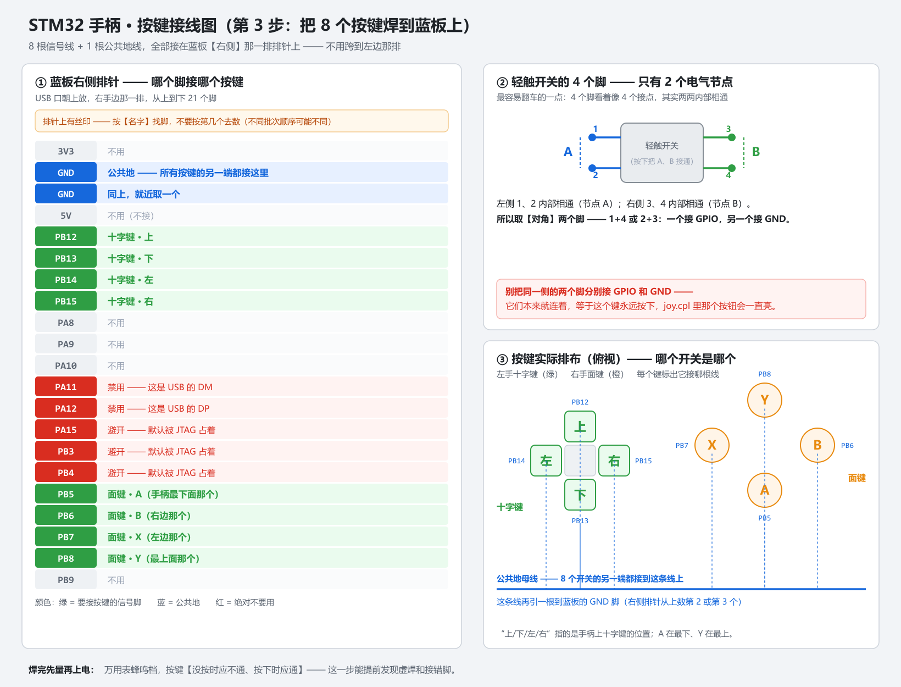
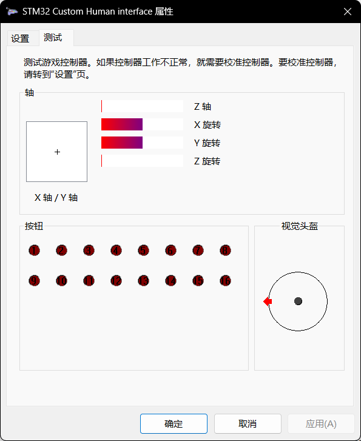

# STM32 游戏手柄固件（USB HID Gamepad）

> 在 STM32F103C8T6 上从零手写的 USB HID 游戏手柄固件。
> 目标不是"能跑就行"，而是**工程级**：每一项完成都有数据能证明，每一个坑都有记录。
> 
> A from-scratch USB HID gamepad firmware on STM32F103, built to engineering standards —
> every milestone is backed by measured data, every pitfall is documented.

**当前状态：第 1~3 步已完成并通过量化验收；第 4~6 步进行中。**



> 当前实物：蓝板 + 洞洞板上的 8 个轻触开关（左 4 个十字键、右 4 个面键），SWD 四线接 ST-Link。
> 摇杆（阶段 4）已到货，尚未接入。

---

## 一、这是什么

一支自己做的有线 USB 手柄。插上电脑就被识别为标准 HID 游戏控制器，能在 Windows 的
"游戏控制器"属性页里看到轴和按钮，能被 Steam 识别，能直接在游戏里用。

为什么不用现成方案：这个项目的目的是**把 USB HID 协议、GPIO/ADC 采样、实时性设计这几件事
从头走一遍**，而不是调个库把它凑出来。所以报告描述符是手写的，消抖是自己设计的状态机，
上报节奏是自己算的。

---

## 二、当前进度

| 阶段  | 内容                                            | 状态               |
|:---:| --------------------------------------------- |:----------------:|
| 1   | USB 枚举成功，被 Windows 认成合法 HID 设备                | ✅ 完成             |
| 2   | 手写报告描述符，出现在"游戏控制器"里                           | ✅ 完成（与第 1 步一并做完） |
| 3   | 8 个按键（十字键 4 触点 + A/B/X/Y）焊好，`joy.cpl` 与游戏中均可用 | ✅ 完成，**含量化验收**   |
| 4   | 接摇杆走 ADC，属性页里光标能跟手                            | ⬜ 进行中            |
| 5   | 死区、滤波、中心校准                                    | ⬜ 计划中            |
| 6   | 无线、振动马达、电池、外壳；延迟与老化测试                         | ⬜ 计划中            |

**最终目标**：有线 + 无线双模，端到端延迟 P50 ≤ 5ms / P95 ≤ 10ms / P99 ≤ 15ms，
双层看门狗、Flash 双备份 + CRC32、支持 DFU 升级、72 小时连续运行不掉线。

---

## 三、硬件

| 部件   | 型号                      | 说明                                     |
| ---- | ----------------------- | -------------------------------------- |
| 主控板  | STM32F103C8T6 最小系统板（蓝板） | 72MHz，64KB Flash                       |
| 下载调试 | ST-Link V2              | SWD 四线                                 |
| 按键   | 6×6 轻触开关 ×8             | 十字键 4 个触点 + A/B/X/Y                    |
| 摇杆   | HW-504 双轴按键摇杆模块         | **3.3V 供电**（模块丝印标的是 +5V，但那会给 ADC 灌 5V） |

### 引脚分配

| 功能                | 引脚                                | 备注              |
| ----------------- | --------------------------------- | --------------- |
| 十字键 上 / 下 / 左 / 右 | `PB12` / `PB13` / `PB14` / `PB15` | 上拉输入，按键另一端接 GND |
| 面键 A / B / X / Y  | `PB5` / `PB6` / `PB7` / `PB8`     | 同上              |
| USB               | `PA11` / `PA12`                   | 占用，不可他用         |
| SWD 调试            | `PA13` / `PA14`                   | 占用，不可他用         |
| 摇杆（第 4 步）         | `PA0` / `PA1`                     | 留给 ADC          |

8 个按键全部用**芯片内部上拉**，按键另一端共地，**不需要外接电阻**。

### 接线图



（矢量版 `docs/wiring-diagram.svg`，可直接用 Inkscape / Illustrator 打开修改）

---

## 四、技术要点

### 1. 报告格式：9 字节

| 字节  | 内容                                  | 空闲值    |
|:---:| ----------------------------------- |:------:|
| 0   | 按键 1—8（A/B/X/Y/LB/RB/View/Menu）     | `0x00` |
| 1   | 按键 9—16（L3/R3/Guide/Share + 4 个预留位） | `0x00` |
| 2   | 方向键 Hat（0—7 方向，8 = 松开）              | `0x08` |
| 3—6 | 左摇杆 X/Y、右摇杆 Rx/Ry（0—255，中位 128）     | `0x80` |
| 7—8 | 左扳机 Z、右扳机 Rz（0—255，0 = 未按下）         | `0x00` |

* 空闲基线：`00 00 08 80 80 80 80 00 00`
* 报告描述符数组 **78 字节**；端点大小 `CUSTOM_HID_EPIN_SIZE = 0x09U`
* **报告长度必须 ≤ 端点大小**，否则超出的部分会被静默丢弃（这里 9 = 9，正好一包发完）

**按键编号不是按物理位置排的**：手柄上 A 在最下、Y 在最上，但报告里 A 是 `bit0`、Y 是 `bit3`。
按视觉顺序写代码会导致进游戏后按键全乱。

**十字键走 Hat 而不是 4 个按键位**：绝大多数游戏期望方向键是 POV hat；拆成普通按钮位的话，
游戏会认不出来，方向键直接失效。物理上它是 4 个触点，但报告里只占 1 个字段。

### 2. 按键读取：非阻塞状态机消抖

按键用**定时轮询**读取（1ms 一拍），不配外部中断。原因：

* HID 是"状态上报"模型，主机每 1ms 来取一次当前状态——按键早 0.2ms 被发现没有意义
* 轮询能保证"一帧报告里的 16 个按键位来自同一时刻"，中断则可能混入不同时刻的状态
* 消抖的本质就是"连续 N 拍读到相同值才认账"，这本来就是轮询逻辑；在 ISR 里做消抖是反模式
* STM32F103 的 EXTI 按引脚编号共享，16 个按键全上中断会撞车，且布线自由度大降

消抖用的是 `stable` + `count` 状态机：**只有"和当前判断矛盾的读数"连续出现够多拍，才改判**。
并且采用**不对称门限**：

```c
#define DB_PRESS_TICKS     2u   /* 按下：连续 2 拍（≈2ms）就认 —— 按下要快 */
#define DB_RELEASE_TICKS   4u   /* 松开：连续 4 拍才认 —— 松开慢几毫秒没人感觉 */
```

**这两个数字是为延迟指标服务的**：网上常见的"稳定 20ms 才认账"会把 P50 ≤ 5ms 的预算直接吃光。
不对称门限让按下延迟压到 2ms，同时抖动绝对造不成误松开（4 个连续 0 在抖动期间拼不出来）。

### 3. 上报节奏

主循环用 `HAL_GetTick()` 做 1ms 节拍，`bInterval = 1`（USB 全速下最小合法值）：

```c
if (HAL_GetTick() - last >= 1)
{
    last = HAL_GetTick();
    scan_buttons();   /* 读 GPIO + 消抖 */
    send_report();    /* 上一包没发完时由 USB 中间件自行丢弃这一帧 */
}
```

---

## 五、已验证的数据

阶段 3 的验收不只靠肉眼。做法是在固件里放 `volatile` 计数器，用 Keil 调试器的 Watch 窗口
配合 Periodic Window Update 实时读取：

| 测什么        | 预期         | 实测        | 结论                        |
| ---------- | ---------- | --------- | ------------------------- |
| 按 A 键 50 次 | 计数 = 50    | **50**    | 按键事件**零丢失**               |
| 单次按下并松开十字键 | 每次 +2      | **稳定 +2** | 按下/松开**边沿无多余跳变**，消抖门限够用   |
| 按住十字键 10 秒 | 计数不变       | **纹丝不动**  | "保持按下"状态稳定，其余引脚无乱抖（排除虚焊）  |
| 快速乱按两个键    | USB 丢帧 = 0 | **0**     | **报告零丢帧**，1ms 节拍与端点轮询正好匹配 |

**结论：按键事件计数与人工输入次数完全一致（零丢失），USB 报告丢帧数为 0。**

Windows 自带的游戏控制器属性页（`joy.cpl`）可以直观看到结果——设备名、6 个轴、16 个按钮、
以及十字键的 POV 指示：



---

## 六、编译与烧写

### 工具链

| 工具           | 版本                       | 说明        |
| ------------ | ------------------------ | --------- |
| STM32CubeMX  | 6.2.1                    | 生成外设初始化代码 |
| Keil MDK-ARM | 5.38（ARM Compiler 6）     | 编译、下载、调试  |
| 器件包          | Keil.STM32F1xx_DFP 2.4.1 |           |

### 步骤

1. 用 CubeMX 打开 `PS.ioc`，`Project Manager → Toolchain` 选 **MDK-ARM V5**，GENERATE CODE
2. **⚠️ 生成之后必须检查三处**（CubeMX 会把它们刷回默认值；这三个值是联动的）：

   | 值 | 在哪里 | 必须是 | 改错的后果 |
   | --- | --- | :---: | --- |
   | `USBD_CUSTOM_HID_REPORT_DESC_SIZE` | `USB_DEVICE/Target/usbd_conf.h` | **78** | 数组被截断 → 报 `excess elements in array initializer`；烧进去描述符残缺，设备管理器出黄色感叹号 |
   | `CUSTOM_HID_EPIN_SIZE` | 同上（+ `usbd_customhid.h`） | **9** | 9 字节报告被拆成 5 个 USB 事务（2+2+2+2+1），总线效率和延迟都变差 |
   | `CUSTOM_HID_FS_BINTERVAL` | 同上（+ `usbd_customhid.h`） | **1** | **主机每 5ms 才来取一次报告** → 更新率上限 200Hz、延迟被量化到 5ms |
   | `USE_HAL_PCD_REGISTER_CALLBACKS` | `Core/Inc/stm32f1xx_hal_conf.h` | **1** | PCD 回调注册 API 全部不可见 → 编译报 `did you mean 'HAL_PCD_DataInStageCallback'?`（延迟测量打点需要这一项） |

   > 两个头文件里的值都加了 `#ifndef` 保护、且默认值已改成正确值，**所以即使 `usbd_conf.h` 被刷掉，也不会退化成原来的 2 / 5**。但 `usbd_conf.h` 仍要复查——它是"一眼能看到"的那一份。
3. 编译一次，**必须 0 warning**
4. Keil 打开 `MDK-ARM/PS.uvprojx`，`Options for Target → Target → ARM Compiler` 选 **version 6**
5. `Project → Rebuild all target files`
6. `Options for Target → Debug` 选 ST-Link Debugger，确认 `SW Device` 能列出 IDCODE
7. 下载，然后 `Win + R` → `joy.cpl` 验收

---

## 七、工程笔记：踩过的坑

这些都是**跟业务代码无关、但能卡住半天**的环境问题，记下来备查。

**1. 一点下载，µVision 整个闪退**
MDK 5.38 自带的新版 ST-Link 驱动有已知 bug（ARM 官方公告 KA005381）：系统里只要有设备的
"设备实例路径"最后一段超过 32 字符，驱动就崩。触发它的甚至可以是**蓝牙虚拟串口**这种无关设备。
解决办法是替换 `Keil_v5/ARM/STLink/STLinkUSBDriver.dll` 为修复版。

**2. 编译 0 秒中止，没有 `.axf`**
CubeMX 固定往工程里写"使用 ARM Compiler 5"，而 MDK 5.37 之后不再自带 AC5。
改 `Options for Target → Target → ARM Compiler` 为 version 6 即可。

**3. 设备管理器里带黄色感叹号（Code 10）**
`The HID Report Descriptor failed validation.` —— CubeMX 生成的 Custom HID 报告描述符是
一个 **2 字节占位符**（`00 C0`，结束集合没有配对的开始集合），必须换成真实描述符。

**4. `use of undeclared identifier 'hUsbDeviceFS'`**
CubeMX 生成的 `usb_device.h` **没有**为 `hUsbDeviceFS` 提供 `extern` 声明（ST 自己的
`usbd_custom_hid_if.c` 也只能在文件内部临时声明一遍）。在自己工程的 `USER CODE` 区补上即可。

**5. 调试器里读不到计数器，永远是 0**
**只写不读的变量会被编译器整个优化掉**（内存里根本没有它）。测计数器的变量必须加 `volatile`，
并且不要加 `static`。

**6. 有三个"联动值"必须一起改，而且都会被 CubeMX 刷回默认值**
`USBD_CUSTOM_HID_REPORT_DESC_SIZE`（描述符字节数 **78**）、`CUSTOM_HID_EPIN_SIZE`（端点包大小 **9**）、
`CUSTOM_HID_FS_BINTERVAL`（轮询间隔 **1ms**）——它们分住在两个头文件里，**没有任何编译期检查盯着**。
只改其中一个，症状的迷惑性各不相同：

* 改漏**描述符长度** → 编译直接报 `excess elements in array initializer`，好发现
* 改漏**端点包大小** → 功能正常，但一个 9 字节报告要拆成 **5 个 USB 事务**（2+2+2+2+1）
* 改漏**轮询间隔** → **功能完全正常，但主机每 5ms 才取一次数据，延迟被悄悄量化到 5ms**

**最后一条最阴，因为它看起来一切正常。** 项目原本报的是"P50 ≤ 5ms"，而配置层面
就已经把这个预算吃光了——固件里再怎么优化都没用。

> 这正是"每一项都要有数据能证明"这条原则的价值所在：**功能对 ≠ 性能对**，
> 而性能问题往往在配置层面就已经埋下，只有靠测量才能发现。

---

## 八、Roadmap

* [ ] **阶段 4**：摇杆接入 ADC（`PA0`/`PA1`），属性页光标跟手
* [ ] **阶段 5**：死区、滤波、中心校准，并测量摇杆分辨率与噪声
* [ ] **阶段 6**：2.4G 无线（含 USB dongle 接收端）、振动马达、锂电池供电、外壳
* [ ] 端到端延迟测量（P50 / P95 / P99），对比指标
* [ ] 72 小时连续运行老化测试，统计丢帧率
* [ ] 看门狗、Flash 双备份 + CRC32、DFU 升级

---

## 九、目录结构

```
Core/
  Inc/  Src/        CubeMX 生成的外设初始化 + 应用层
    button_front.c  按键扫描、消抖状态机、Hat 编码
    report.c        HID 报告缓冲区与发送
USB_DEVICE/         USB 设备描述符与 Custom HID 类接口
  App/usbd_custom_hid_if.c   报告描述符数组在这里
  Target/usbd_conf.h         REPORT_DESC_SIZE 在这里
Middlewares/        ST USB 设备库
Drivers/            HAL 与 CMSIS
MDK-ARM/            Keil 工程
PS.ioc              CubeMX 工程定义
```

---

## 十、关于本项目

个人学习和作品集项目，从零实现，边做边记录。欢迎交流。
